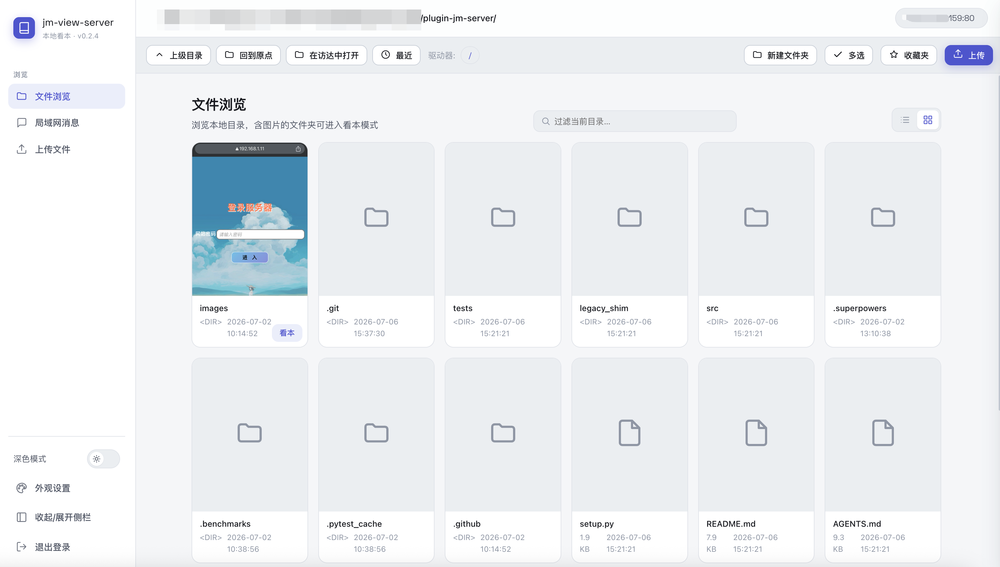
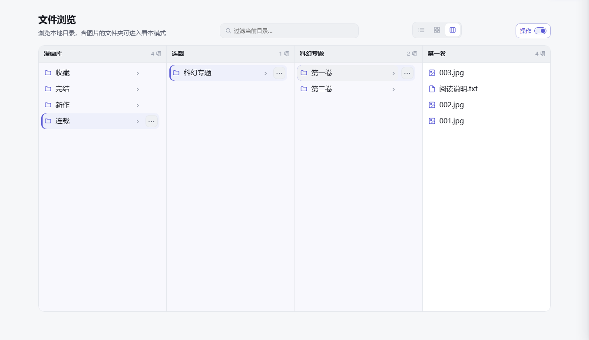
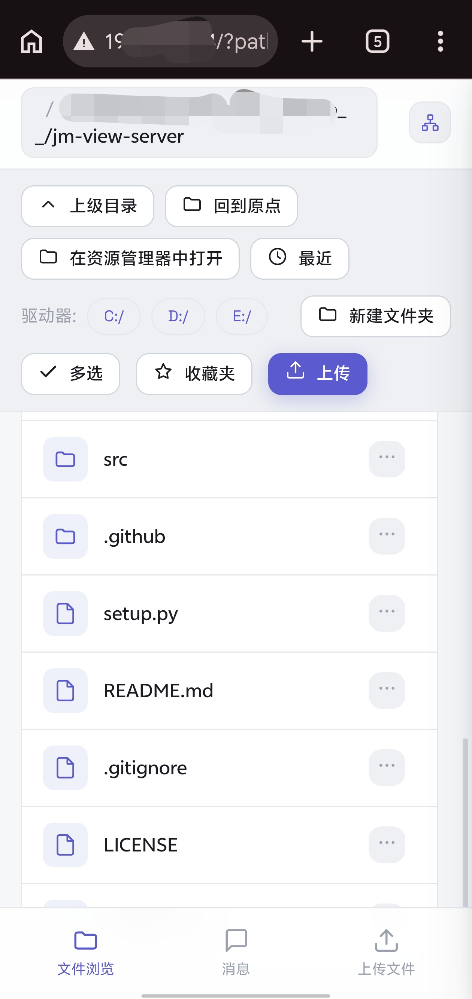
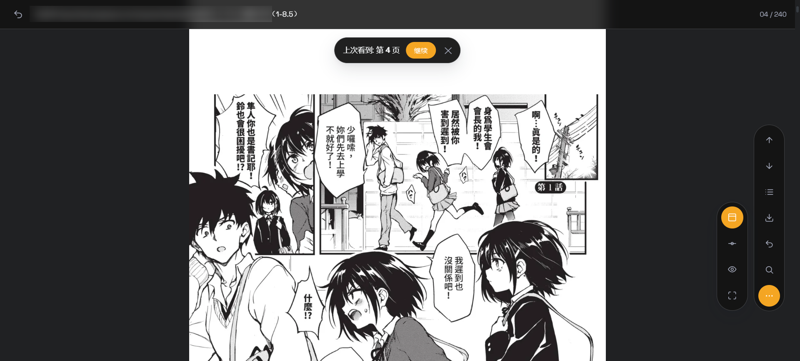
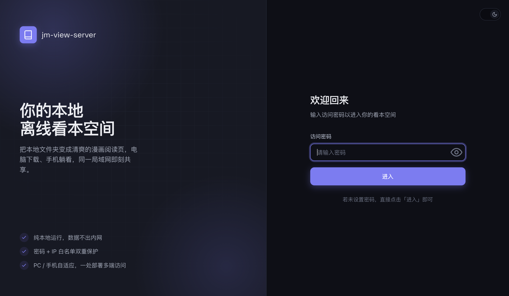
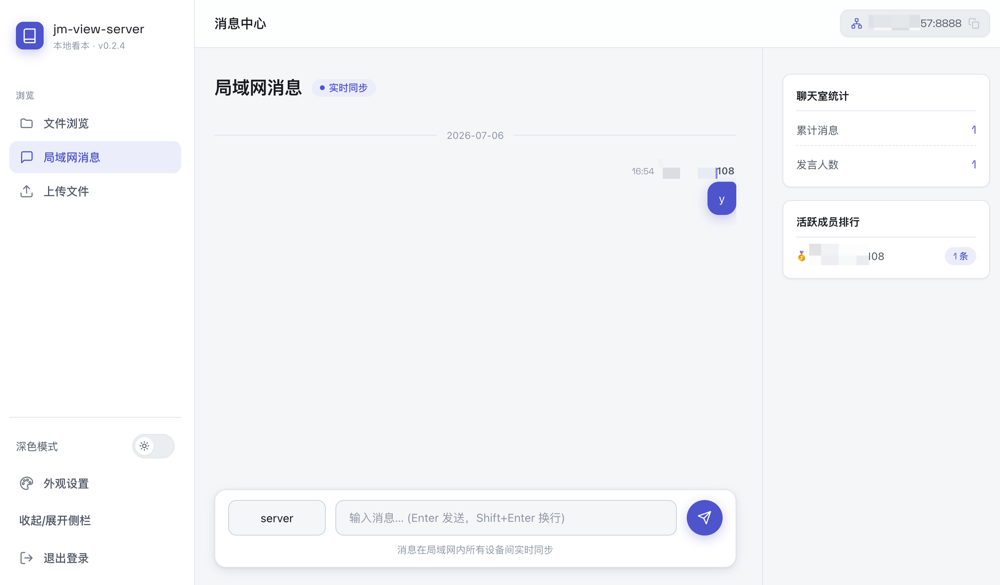

<!-- 顶部标题 & 统计徽章 -->
<div align="center">
  
  <h1 style="margin-top: 15px" align="center">jm-view-server</h1>

  <p align="center">
  <strong>“离线版”禁漫天堂，你的纯本地 离线看本神器！</strong>
  </p>

[](https://github.com/hect0x7)
[](https://github.com/hect0x7/jm-view-server/stargazers)
[](https://github.com/hect0x7/jm-view-server/forks)
[](https://pypi.org/project/jm-view-server/)
[](https://pepy.tech/projects/jm-view-server)
[](https://github.com/hect0x7/jm-view-server)


</div>

> 该项目会在你的电脑上启动一个**本地文件服务器**。你可以直接在浏览器（手机或电脑）中打开它，它会把本地文件夹里的图片转换成类似“禁漫天堂”的章节观看页面。
>
> **核心优势**：
> - 原生支持**连续下拉、单页翻页、无缝双页**三种阅读模式，无需额外安装阅读插件。
> - 仍可配合各种浏览器插件和用户脚本，继续扩展个性化阅读能力。
> - 一键开启局域网共享，电脑下载，躺在床上用手机看。
>
> 从 v0.2.4 起，本项目正式更名为 `jm-view-server`，原名 `plugin-jm-server`
> ，安装了旧包的老用户请参考文末的 [老用户迁移指南](#老用户迁移指南) 进行升级。
>
> 各版本的新增、优化与修复内容统一记录在 [CHANGELOG.md](CHANGELOG.md)。


---

## 🌟 效果展示

### 1. 文件夹管理

| 视图     | 功能特色                                                                                | 使用场景          |
|--------|-------------------------------------------------------------------------------------|---------------|
| **列表** | 紧凑展示文件信息，支持排序、书签、多选及文件管理操作。                                                         | 按文件名快速扫描和批量整理 |
| **网格** | 以文件夹首图作为预览封面，支持多选及文件管理操作。                                                           | 依靠封面快速识别漫画    |
| **分栏** | 模仿mac finder分栏识图，桌面端最多同时展示四层目录并自动向左推进，刷新后恢复目录链；支持键盘导航、快捷方式和紧凑 `⋯` 操作菜单，窄屏自动切换为单列导航。 | 连续浏览多层目录      |

*(电脑端：列表视图)* 
*(电脑端：网格视图)* 
*(电脑端：Finder 分栏视图)* 
*(手机端：文件夹列表)* 

### 2. 看本与阅读体验（模仿JM章节阅读页面）

| 功能 / 模式 | 功能特色 | 使用场景 |
| :--- | :--- | :--- |
| **下拉阅读** | 分段懒加载图片并自然滚动，支持进度记忆、跳页和护眼模式。 | 条漫、快速浏览和长章节 |
| **单页翻页** | 支持点击画面左右区或键盘翻页、窗口适应、自定义图片尺寸、进度记忆和跳页。 | 传统漫画和键盘操作 |
| **无缝双页** | 纵图自动成对、横图自动跨页，支持从左向右与从右向左（日漫）排版方向、无缝衔接、进度记忆和护眼模式。 | 横屏桌面阅读与日漫对开 |
| **缩略图画板** | 独立可视化卡片画板（Contact Sheet），支持卡片自由拖拽调序、一键整本倒序、悬停插入/删除空白页以调整双页对齐、双页对开预览排版与顺序记忆开关。 | 漫画对齐校对、章节审阅与跳页 |

*(电脑端：无缝双页模式)* 
*(电脑端：下拉模式)* 
*(手机端：看本模式)* 
*(电脑端：缩略图画板总览)* 
*(电脑端：缩略图双页对开预览)* 

### 3. 其他功能

| 功能       | 特色                               | 使用场景           |
|----------|----------------------------------|----------------|
| **访问保护** | 支持登录密码、指定设备 IP 白名单和 HTTPS 自签名证书。 | 限制局域网内的访问范围    |
| **文件上传** | 支持网页拖拽上传，并明确显示文件的目标目录和保存路径。      | 从手机或其他设备向电脑传文件 |
| **消息中心** | 支持消息记录、复制、昵称记忆以及桌面和网页内通知。        | 同一局域网内的设备互发文字  |

*(登录密码验证)* 
*(局域网消息界面)* 

---

## 🚀 小白快速上手指南

如果你不懂编程，请严格按照以下两步操作即可：

### 第一步：环境准备

本项目基于 Python 开发，因此你的电脑必须先安装 Python。

- 请前往 [Python 官网](https://www.python.org/downloads/) 下载并安装最新版 Python（安装时请务必勾选
  `Add Python to PATH`）。

### 第二步：一键安装与启动

打开你电脑的**命令行终端**，复制并执行对应的命令：

- **Windows** (PowerShell):
  ```powershell
  pip install jm-view-server ; jms
  ```
- **macOS / Linux**:
  ```bash
  pip3 install jm-view-server && jms
  ```

> **提示**：这行命令会帮你自动下载安装必要的组件，并以默认配置启动服务器。如果提示 80 端口无权限，可以参考下方进阶参数指定高位端口（如
`-p 8080`）。

**启动成功后怎么用？**
终端里会打印出两行地址，例如：

- 本机访问：`http://127.0.0.1:80`
- 局域网访问：`http://192.168.1.100:80`

你只需要在电脑的浏览器里打开第一个地址，或者在连着同一个 WiFi 的手机浏览器里打开第二个地址，就可以开始看漫画了！

> **提示**：如果在终端没看清局域网地址也没关系，当你用电脑打开本机地址后，**网页的主页顶部也会直接显示并智能识别当前的局域网地址
**，你可以一键复制发给手机直接访问。

---

## ⚙️ 进阶使用（针对有经验的用户）

安装后系统会注册 `jms` 命令，无需写代码即可通过丰富的参数进行个性化启动：

```shell
# 共享指定目录 ~/comics，并使用 8080 端口（高位端口无需管理员权限）
jms ~/comics -p 8080

# 设置登录密码为 123，并启用 HTTPS
jms ~/comics -P 123 -s

# 仅允许指定 IP 的设备访问
jms ~/comics --ip-whitelist 192.168.1.10,192.168.1.11

# 加载 jmcomic 配置开启在线下载
jms ~/comics -o op.yml
```

**全部参数说明（可通过 `jms -h` 查看）：**
| 参数 | 说明 | 默认值 |
| --- | --- | --- |
| `path` | 要共享的根目录（位置参数） | 当前目录 |
| `-P, --password` | 登录密码，空表示免密 | 空 |
| `-H, --host` | 监听地址 | `0.0.0.0` |
| `-p, --port` | 监听端口 | `80` |
| `-s, --ssl` | 启用 HTTPS（adhoc 自签名） | 关闭 |
| `-o, --option` | [jmcomic](https://github.com/hect0x7/JMComic-Crawler-Python) 配置文件路径，开启在线下载 | 无 |
| `--ip-whitelist` | IP 白名单，逗号分隔 | 不限制 |
| `--current-path` | 初始当前路径 | 同 `path` |
| `-e, --env` | 设置环境变量 `KEY=VALUE`，可重复 | 无 |
| `--debug` | 开启 Flask debug 模式 | 关闭 |

> 注：如果你在 Linux/macOS 上启动报错没有权限，是因为绑定默认的 80 端口需要管理员权限。建议加上 `-p 8080` 参数改用其他端口。

---

## 👨‍💻 开发者专属区域

如果你想在自己的 Python 脚本中集成或二次开发该服务，可以通过代码进行调用。

### 1. HTTP / HTTPS 原生调用

```python
from jm_view_server import *

# 启动 HTTP 服务
server = JmServer('D:/', 'password')
server.run(host='0.0.0.0', port=80)

# 启动 HTTPS 服务 (需要安装 cryptography)
server.run(host='0.0.0.0', port=443, ssl_context='adhoc')
```

### 2. 作为 jmcomic 的插件集成

你可以在 `jmcomic` 的 `op.yml` 配置文件中配置它：

```yml
plugins:
  after_init:
    - plugin: jm_server
      kwargs:
        password: ''
```

对应的启动脚本注意事项：

```python
from jmcomic import *

op = create_option('op.yml')
op.download_album(123)

# 注意：虽然爬虫主线程执行完毕，但 Web 服务器线程仍在运行中。
# 需要用户手动按 Ctrl+C 退出。
# Python 3.12+ 特别注意：必须插入下面这行代码，Web 服务器才能继续处理请求！
op.wait_all_plugins_finish()
```

---

## 老用户迁移指南

原名 `plugin-jm-server` 里的 `plugin-` 前缀会让人误以为它必须搭配 jmcomic 才能用。其实它**首先是一个可独立运行的本地看本服务器
**，jmcomic 插件只是附加能力，因此更名为 `jm-view-server`。

**老用户迁移** —— 一行搞定：

```shell
pip uninstall -y plugin_jm_server && pip install jm-view-server
```

命令行 `jms` 和 jmcomic 插件 key `jm_server` **都不变**；脚本里把 `import plugin_jm_server` 换成 `import jm_view_server`
即可（不换也行，旧包名仍能用）。

> 旧包 `plugin_jm_server` 仍保留在 PyPI 上做**重定向薄壳**：安装它会自动带上 `jm-view-server`，旧的 `import` 和 `jms`
> 命令继续可用，仅在导入时打印一条弃用提示。建议尽快迁移到新包名。

---

## 💡 想法起源

- 想法起源：https://github.com/hect0x7/JMComic-Crawler-Python/issues/192
- UI 与部分基础架构参考：https://github.com/AiCorein/Flask-Files-Server
